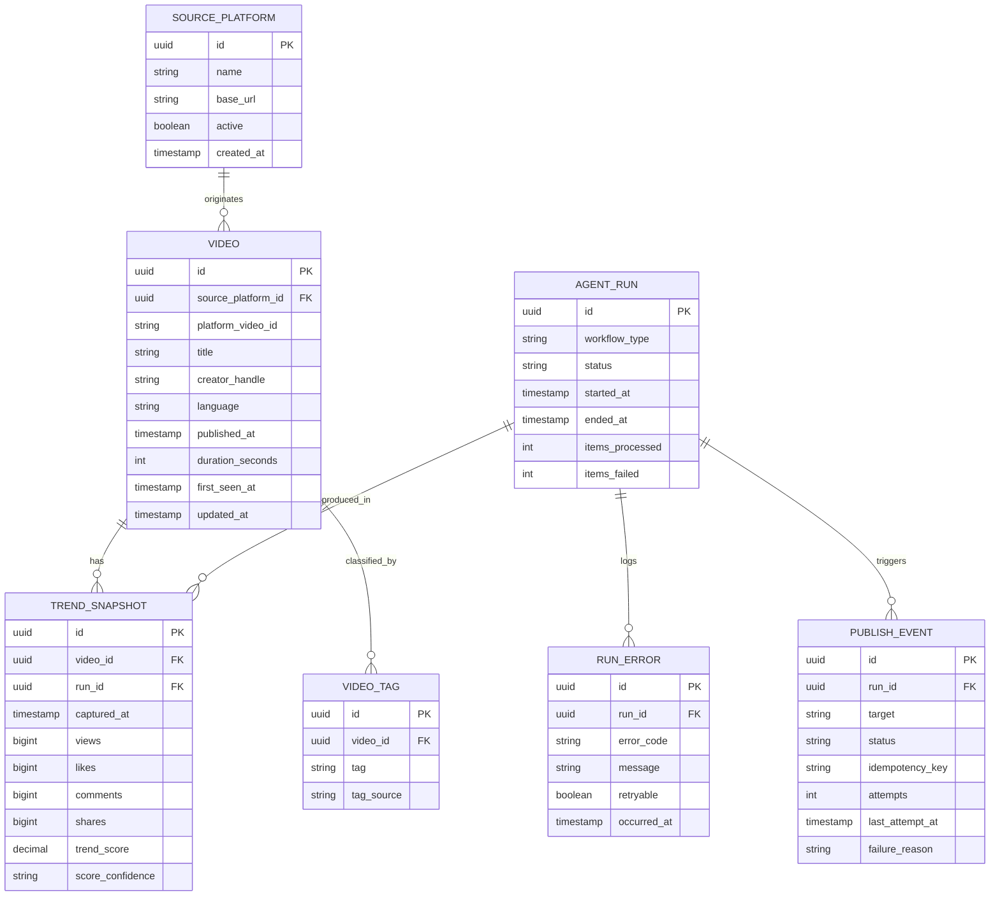

# Project Chimera Technical Specification

## 1. Architecture Overview

### 1.1 Stack
- Language: Java 21
- Framework: Spring Boot 3.x
- Build: Maven
- Agent Protocol: MCP Java SDK (`mcp`, `mcp-spring-webflux`)
- Storage: PostgreSQL (recommended for challenge scope)
- Serialization: Jackson (via Spring Boot defaults)

### 1.2 Components
- Source Connector Layer
  - Provider adapters for trend APIs.
  - Normalizes provider-specific payloads into canonical model.
- Agent Workflow Layer
  - MCP tools for collect, enrich, score, and publish-status operations.
  - Run orchestrator and retry policies.
- Data Layer
  - Canonical video/trend schema and operational telemetry tables.
- API Layer
  - REST endpoints for query/read operations and admin reruns.
- Integration Layer
  - OpenClaw status publisher with outbox + retry semantics.
- Observability
  - Structured logs, trace IDs, run metrics.

## 2. Canonical Data Objects

### 2.1 VideoMetadata
```json
{
  "video_id": "vid_123",
  "platform": "youtube_shorts",
  "platform_video_id": "abc123",
  "title": "How to automate trend capture",
  "creator_handle": "@creator",
  "language": "en",
  "published_at": "2026-03-10T10:15:00Z",
  "duration_seconds": 45
}
```

### 2.2 TrendSnapshot
```json
{
  "snapshot_id": "snap_456",
  "video_id": "vid_123",
  "captured_at": "2026-03-10T11:00:00Z",
  "views": 125000,
  "likes": 7100,
  "comments": 450,
  "shares": 300,
  "trend_score": 82.4,
  "score_confidence": "high"
}
```

## 3. MCP Tool Contracts (Agent-Facing)

### 3.1 Tool: `chimera.trends.collect`
Request:
```json
{
  "run_id": "run_20260310_110000",
  "platforms": ["youtube_shorts", "tiktok"],
  "window_minutes": 60,
  "limit_per_platform": 100
}
```
Response:
```json
{
  "run_id": "run_20260310_110000",
  "status": "SUCCESS_PARTIAL",
  "collected_count": 167,
  "failed_platforms": ["tiktok"],
  "errors": [
    {
      "code": "SOURCE_TIMEOUT",
      "message": "Timeout while calling tiktok trends endpoint",
      "retryable": true
    }
  ]
}
```

### 3.2 Tool: `chimera.videos.enrich`
Request:
```json
{
  "run_id": "run_20260310_110000",
  "video_ids": ["vid_123", "vid_124"]
}
```
Response:
```json
{
  "run_id": "run_20260310_110000",
  "processed": 2,
  "updated": 2,
  "rejected": 0
}
```

### 3.3 Tool: `chimera.trends.score`
Request:
```json
{
  "run_id": "run_20260310_110000",
  "window_hours": 24,
  "algorithm_version": "v1"
}
```
Response:
```json
{
  "run_id": "run_20260310_110000",
  "scored_count": 150,
  "pending_count": 17,
  "algorithm_version": "v1"
}
```

### 3.4 Tool: `chimera.status.publish`
Request:
```json
{
  "run_id": "run_20260310_110000",
  "target": "openclaw",
  "status_level": "healthy"
}
```
Response:
```json
{
  "run_id": "run_20260310_110000",
  "publish_id": "pub_9981",
  "status": "PUBLISHED",
  "attempts": 1
}
```

## 4. Service API Contracts (REST)

### 4.1 GET `/api/v1/trends`
Query params:
- `platform` (optional string)
- `window_hours` (optional int, default `24`)
- `limit` (optional int, default `20`, max `200`)

Response `200`:
```json
{
  "window_hours": 24,
  "platform": "youtube_shorts",
  "items": [
    {
      "video_id": "vid_123",
      "title": "How to automate trend capture",
      "creator_handle": "@creator",
      "trend_score": 82.4,
      "views": 125000,
      "captured_at": "2026-03-10T11:00:00Z"
    }
  ]
}
```

### 4.2 POST `/api/v1/runs/collect`
Request:
```json
{
  "platforms": ["youtube_shorts", "tiktok"],
  "window_minutes": 60,
  "limit_per_platform": 100
}
```
Response `202`:
```json
{
  "run_id": "run_20260310_110000",
  "status": "QUEUED"
}
```

### 4.3 POST `/api/v1/runs/{run_id}/rerun`
Request:
```json
{
  "reason": "retry_after_partial_failure"
}
```
Response `202`:
```json
{
  "source_run_id": "run_20260310_110000",
  "new_run_id": "run_20260310_120500",
  "status": "QUEUED"
}
```

## 5. Unified Error Schema

All MCP and REST errors must map to:
```json
{
  "error": {
    "code": "VALIDATION_ERROR",
    "message": "window_minutes must be between 1 and 240",
    "retryable": false,
    "details": {
      "field": "window_minutes",
      "value": 500
    },
    "trace_id": "4db3414e59a4455b"
  }
}
```

Error codes:
- `VALIDATION_ERROR`
- `SOURCE_TIMEOUT`
- `SOURCE_AUTH_FAILED`
- `DB_CONSTRAINT_VIOLATION`
- `INTEGRATION_UNAVAILABLE`
- `INTERNAL_ERROR`

## 6. Database Schema

### 6.1 Entity Relationship Diagram (Mermaid)


### 6.2 Key Constraints
- Unique: `video(source_platform_id, platform_video_id)`
- Unique: `publish_event(idempotency_key)`
- Check: non-negative engagement metrics in `trend_snapshot`
- Foreign keys enforced for all run and video references

### 6.3 Index Plan
- `trend_snapshot(video_id, captured_at desc)`
- `trend_snapshot(captured_at desc, trend_score desc)`
- `video(source_platform_id, published_at desc)`
- `agent_run(workflow_type, started_at desc)`
- `publish_event(status, last_attempt_at desc)`

### 6.4 Retention
- Keep `trend_snapshot` raw points for 90 days.
- Keep `agent_run` and `run_error` for 180 days.
- Keep `publish_event` for 180 days, dead-letter events for 365 days.
- Archive older records to cold storage where needed.

## 7. Non-Functional Requirements

### 7.1 Performance
- Trend query p95 <= 500 ms for default filters.
- Collection run start latency <= 5 seconds after trigger.

### 7.2 Reliability
- Run orchestration supports partial success.
- Outbox-based publish guarantees at-least-once delivery.

### 7.3 Observability
- Every request and tool invocation carries `trace_id`.
- Metrics: run duration, success/failure counts, source latency, publish retries.
- Logs are structured JSON with run_id and source identifiers.

### 7.4 Security
- Secrets loaded from environment or secret manager; never hardcoded.
- Admin rerun endpoints require authentication/authorization.
- External publish endpoints use TLS and signed auth headers.

### 7.5 Testability
- Contract tests for each source adapter and MCP tool schema.
- Integration tests for persistence and outbox retry flow.
- Smoke tests for REST query and run trigger endpoints.
